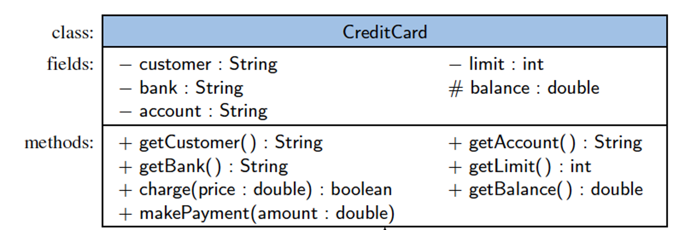
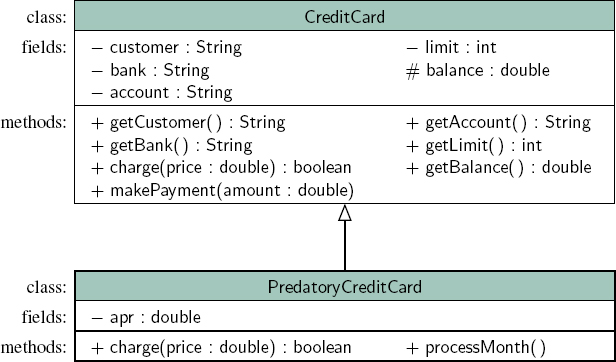

# Chapter 2 - Object-Oriented Design
As the name implies, the main “actors” in the object-oriented paradigm are called **objects**.  
## Terminology
Each object is an **instance** of a **class**.  
Each class presents to the outside world a concise and consistent view of the objects that are instances of this class, without going into too much unnecessary detail or giving others access to the inner workings of the objects.  
The class definition typically specifies the **data fields**, also known as **instance variables**, that an object contains, as well as the methods (operations) that an object can execute. This view of computing fulfill several goals and incorporates design principles, which we will discuss in this chapter.
## Programming Goals
**Robustness** - We want software to be capagble of handling unexpected inputs that are not explicityly defined for its application.  
**Adaptability** - Software needs to be able to evolve over time in response to changing conditions in its environment.  
**Reusability** - The same code should be usable as a component of different systems in various applications.  
## Abstract Data Types  
**Abstraction** is to distill a system to its most fundamental parts.  
Applying the abstraction paradigm to the design of data structures gives rise to **abstract data types** (ADTs).  
An ADT is a model of a data structure that specifies the **type** of data stored, the **operations** supported on them, and the types of parameters of the operations.  
An ADT specifies what each operation does, but not how it does it.  
The collective set of behaviors supported by an ADT is its **public interface**.  
## Interfaces and Abstract Classes  
The main structural element in Java that enforces an application programmin interface (API) is an **interface**.  
An interface is a collection of method declarations with no data and no bodies.  
Interfaces do not have constructors and they cannot be directly instantiated.  
- When a class **implements** an interface, it must implement all of the methods declared in the interface.  

An abstract class also cannot be instantiated, but it can define one or more common methods that all implementations of the abstraction will have.  

## Design Patterns
A **Design Pattern** describes a solution to a *typical* software problem.  A pattern provides a general template for a solution that can be applied in many different situations.  
### Algorithmic Design Patterns  
- **Recursion** - a programming and mathematical technique where a function or definition calls itself to solve smaller instances of a complex problem, breaking it down until a base case is reached.  
- **Amoritzation** - a method for analyzing a given algorithm's complexity, or how much of a resource, especially time or memory, it takes to execute.  
- **Divide-and-conquer** - breaks down a problem into two or more sub-problems of the same or related type, until these become simple enough to be solved directly.  
- **Prune-and-search** - a recursive procedure in which at each step the input size is reduced ("pruned") by a constant factor.  
- **Brute Force** - systematically testing every possible candidate solution until the correct one is found.  
- **The Greedy Method** - at each step, makes the choice that is locally optimal, and subsequently does not reconsider past choices.  
- **Dynamic Programming** - used to solve complex problems by breaking them down into simpler, overlapping subproblems.  

### Software Design Patterns  
- **Iterator** - abstracts the process of scanning through a sequence of elements, one element at a time.  
- **Adapter** - applies to any context where we effectively want to modify an existing class so that its methods match those of a related, but different, class or interface.  
- **Position** - acts as a marker or token within a broader positional list.  
- **Composition** - used when we wish to treat a pair or collection of values as a single object.  
- **Template Method** - an abstract base class provides a concrete behavior that relies upon calls to other abstract behaviors.  

## Object-Oriented Software Design  
**Responsibilities** - Divide the work into different actors, each with a different responsibility.  
**Independence** - Define the work for each class to be as independent from other classes as possible.  
**Behaviors** - Define the behaviors for each class carefully and precisely, so that the consequences of each action performed by a class will be well understood by other classes that interact with it.  

## Unified Modeling Language (UML)  
A **class diagram** has three portions.
- The name of the class  
- The recommended instance variables  
- The recommended methods of the class.  

## Class Definitions  
A class serves as the primary means for abstraction in object-oriented programming.  
In Java, every variable is either a base type or is a reference to an instance of some class.  
A class provides a set of behaviors in the form of member functions (also known as **methods**), with implementations that belong to all its instances.  
A class also serves as a blueprint for its instances, effectively determining the way that state information for each instance is represented in the form of **attributes** (also known as **fields, instance variables** or **data members**).

## Constructors  
A user can create an instance of a class by using the **new** operator with a method that has the same name as the class.  
Such a method, known as a **constructor**, has as its responsibility to establish the state of a newly created object with appropriate initial values for its instance variables.  

## Inheritance  
A mechanism for a modular an hierarchical organization is **inheritance**.  
This allows a new class to be defined based upon an existing class as the starting point.  
The existing class is typically described as the **base class**, parent class or superclass, while the newly defined class is known as the **subclass** or child class.  
There are two ways in which a subclass can differentiate itself from its superclass:  
- A subclass may specialie an existing behavior by providing a new implementation that overrides an existing method.  
- A subclass may also extend its superclass by providing brand new methods.  

This is an example of an UML diagram that serves as an overview of our design for the new *PredatoryCreditCard* class as a subclass of the existing *CreditCard* class.  

[Click Here](EX2_01/CreditCard.java) or navigate to the EX2_01 folder to take a look at the *PredatoryCreditCard.java* subclass.

## Inheritance and Constructors  
Constructors are never inherited in Java; hence, every class musth define a constructor for itself.  
- All of its fields mus be properly initialized, including any inherited fields.  

The first operation within the body of the constructor must be to invoke a constructor of the superclass which initializes the fields defined in the superclass.  
A constructor of the superclass is invoked explicitly by using the keyword **super** with appropriate parameters.  
If a constructor for a subclass does not make an explicit call to **super** or **this** as its first command, then an implicit call to **super()**, the zero-parameter version of the superclass constructor, will be made.  

## An Extended Example  
A **numeric progression** is a sequence o fnumbers, where each number depends on one or more of the previous numbers.  
[Click Here](/workspaces/CSCI161-CH02-EXAMPLES/EX2_02/Progression.java) or navigate to the EX2_02 folder to work with a simple progression.
- An **arithmetic progression** determines the next number by adding a fixed constant to the previous value.  [Click Here](EX2_03/ArithmeticProgression.java) to see this example.
- A **geometric progression** determines the next number by multiplying the previous value by a fixed constant.  [Click Here](EX2_04/GeometricProgression.java) to see this example.
- A **Fibonacci progression** uses the formula $N_{i+1}=N_i+N_{i-1}$  

